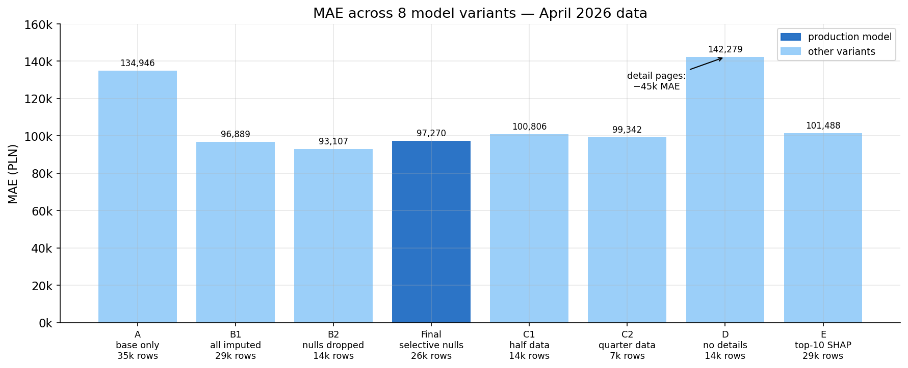
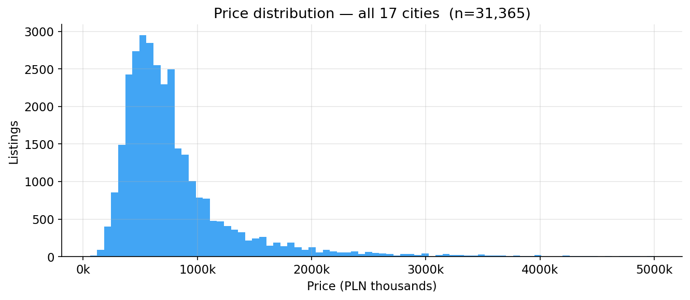
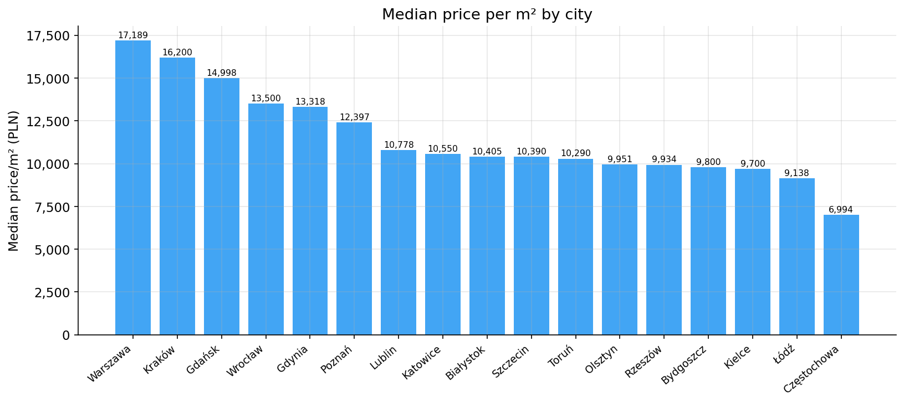
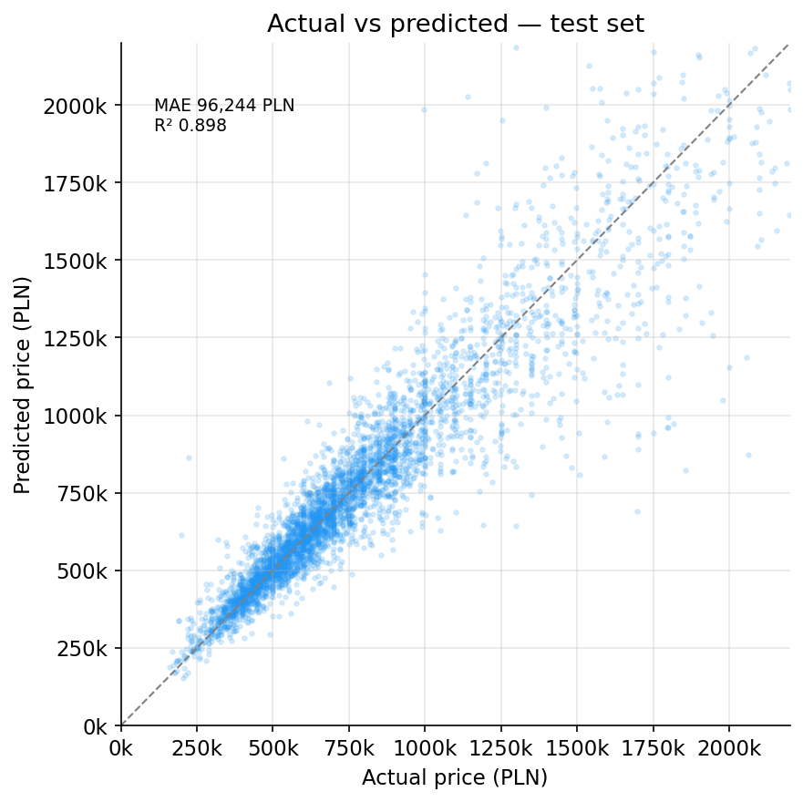

# Polish Apartment Price Estimator

XGBoost regression model predicting apartment sale prices across 17 Polish cities. Trained on 36,318 listings scraped from Otodom.pl — including a second scraping pass to collect detail-page features (year built, finish condition, amenities). Includes a full MLOps pipeline with automated retraining on data push and an interactive Streamlit app.

[](https://housing-price-pl.streamlit.app/)
[](https://colab.research.google.com/drive/1nXcHTvFfS6U8HSlu_Sb0YZniJptyCxnr?usp=sharing)
[](https://colab.research.google.com/drive/1L4MxZNrdZrSq5ULY--fQRK9zgz_NpU0D?usp=sharing)

---

## Results

Evaluated on 36,318 listings scraped from Otodom.pl in April 2026.

| Metric | Baseline (list-view only) | Final model (+ detail features) |
|---|---|---|
| R² | 0.820 | **0.903** |
| MAE | 134,946 PLN | **97,270 PLN** |
| Median MAPE | ~15% | **7.9%** |
| Training rows | 35,543 | 26,305 |
| Features | 6 | 45+ |

Detail features reduced MAE by **~45,000 PLN** on equivalent rows. Adding detail pages was more valuable than adding more listings.

---

## Visualizations

**Why scraping detail pages matters — MAE across 8 model variants**



Variants A and D use only list-view features — no detail pages scraped. D and C1 cover identical rows; adding detail features drops MAE from 142k to 100k PLN on the same data. The Final model applies a selective null strategy across all listings with available detail pages.

**Price distribution — 36,318 listings across 17 cities**



The bulk of listings falls between 200k and 800k PLN. The right tail thins out above 1M — reflected in higher model error at the top end (see below).

**Median price per m² by city**



Warsaw and Gdańsk lead by a wide margin. The gap between the top 3 and the remaining 14 cities is larger than the spread within those 14 — location accounts for 23% of model output (city + neighborhood SHAP combined).

**Predicted vs actual price — test set (5,261 listings)**



Well-calibrated across the core 300k–1.2M PLN range. The scatter widens at higher prices: rarer luxury listings have less training data, and small relative errors translate to larger absolute ones.

---

## Data Collection

**Two-phase scraping pipeline:**

**Phase 1 — List-view scraping (`scraper.py`)**

Scrapes Otodom.pl category pages using `requests` + `BeautifulSoup`. Each page embeds a `<script id="__NEXT_DATA__">` JSON block (Next.js SSR) with the full structured payload — no headless browser required. Covers all 17 cities at both city-level and district-level URLs to bypass Otodom's 500-listing pagination limit.

**Phase 2 — Detail-page scraping (`scrape_details.py`)**

Fetches individual listing pages for all collected URLs to extract features unavailable in the list view: year built, building type, heating type, finish condition, and 13 boolean amenity flags (elevator, balcony, garage, etc.). Incremental — only new URLs are fetched on re-runs. Resumable every 100 records.

| Property | Value |
|---|---|
| Listings scraped | 36,318 |
| Detail pages scraped | 35,225 (84.1% coverage) |
| Cities | 17 |
| Property type | Apartments (`estate == "FLAT"`) |
| Price range | 50,000 – 5,000,000 PLN |
| Area range | 15 – 250 m² |
| Price/m² ceiling | 40,000 PLN/m² |
| International listings | Filtered out by currency check (`currency == "PLN"`) |

**17 cities:** Białystok, Bydgoszcz, Częstochowa, Gdańsk, Gdynia, Katowice, Kielce, Kraków, Lublin, Łódź, Olsztyn, Poznań, Rzeszów, Szczecin, Toruń, Warszawa, Wrocław

---

## Feature Engineering

### Encoding

**Target encoding** for `city` and `neighborhood` — each location is replaced by the mean `log1p(price)` in the training set, fit on train data only (anti-leakage). This directly encodes the location price signal rather than an arbitrary integer order.

**One-hot encoding** for low-cardinality categoricals: `stan_wykonczenia` (finish condition), `rodzaj_zabudowy` (building type), `ogrzewanie` (heating), `forma_wlasnosci` (ownership form), `rynek` (primary/secondary market), `okna` (windows).

**Boolean flags** cast to int: `winda`, `balkon`, `taras`, `ogrodek`, `piwnica`, `garaz`, `klimatyzacja`, and 6 others.

### Null strategy (selective)

| Column | Strategy | Reason |
|---|---|---|
| `rok_budowy`, `stan_wykonczenia` | Drop rows | Top-6 SHAP — imputing adds noise |
| `ogrzewanie`, `rodzaj_zabudowy`, `forma_wlasnosci`, `okna` | Impute mode | Low SHAP signal |
| `liczba_pieter` | Impute median | Low SHAP signal |
| `neighborhood` | Fill with city name | Preserves row |
| `rooms`, `floor` | Impute city median | Preserves row |

### Top features by SHAP importance

| Rank | Feature | Mean \|SHAP\| |
|---|---|---|
| 1 | `area_m2` | 0.246 |
| 2 | `neighborhood_enc` | 0.162 |
| 3 | `rok_budowy` | 0.075 |
| 4 | `city_enc` | 0.068 |
| 5 | `winda` | 0.027 |
| 6 | `stan_wykonczenia_ready_to_use` | 0.023 |
| 7 | `rooms` | 0.016 |
| 8 | `rynek_primary` | 0.011 |

---

## Research: Feature Study

Eight model variants were tested to determine the optimal data collection strategy. Full analysis in [`notebooks/feature_study.ipynb`](notebooks/feature_study.ipynb).

| Variant | Rows | Features | MAE PLN | R² | Notes |
|---|---|---|---|---|---|
| A | 35,543 | base only | 134,946 | 0.820 | No detail scraping |
| B1 | 29,871 | base + details | 96,889 | 0.903 | All nulls imputed |
| B2 | 14,421 | base + details | 93,107 | 0.902 | All null rows dropped |
| **Final** | **26,305** | **base + details** | **97,270** | **0.903** | **Selective null strategy** |
| C1 | 14,727 | base + details | 100,806 | 0.907 | Half data, stratified |
| C2 | 7,071 | base + details | 99,342 | 0.894 | Quarter data, stratified |
| D | 14,727 | base only | 142,279 | 0.813 | Same rows as C1, no details |
| E | 29,871 | top-10 SHAP | 101,488 | 0.893 | Feature selection hurts |

**Key findings:**
1. Detail features reduce MAE by ~45k PLN on equivalent rows (D → Final: 142k → 97k)
2. Data volume has diminishing returns — halving rows costs only ~4k PLN MAE
3. Scraping detail pages is more valuable than scraping more listings
4. Feature selection hurts — full feature set beats top-10 SHAP subset

---

## Model

**XGBoost** regressor, `log1p` target, `expm1` at inference.

```python
XGBRegressor(
    n_estimators=800, learning_rate=0.05, max_depth=6,
    subsample=0.8, colsample_bytree=0.8, min_child_weight=5,
    random_state=17, n_jobs=-1,
)
```

80/20 train-test split, `random_state=17`. Experiment tracking via MLflow → DagsHub.

---

## Pipeline Architecture

**1. Data collection** — `scraper.py` (17 cities, list-view) + `scrape_details.py` (incremental detail pages) → `data/raw/` → `git push`

**2. Retraining** — GitHub Actions triggers on push to `data/raw/`:
- `validate.py` — schema check, record counts per city
- `train.py` — XGBoost + MLflow logging to DagsHub
- `evaluate.py` — candidate vs production on the same test set
  - candidate better → commit `model_artefacts/`
  - candidate worse → log run, exit without deploying

**3. Deployment** — Streamlit Community Cloud auto-redeploys on push to `main` when `model_artefacts/` changed

**Evaluation logic:** both models are scored on the **same new test set** — avoids comparing models trained on different data distributions.

---

## Streamlit App

### Estimate Price

Input: city, neighborhood, area, rooms, floor, year built, finish condition, elevator.

Output:
- Estimated price + price/m² + city median + deviation from median
- Price distribution histogram — neighborhood overlaid on city
- Cross-city benchmark — same spec predicted across all 17 cities
- Neighborhood ranking — all districts in the selected city
- Price sensitivity chart — tornado diagram: area ±20%, rooms ±1, floor ±1, year built ±10, elevator No→Yes, condition worst→best
- Comparable listings table — 6 closest real listings with links to Otodom.pl

Warning shown when estimate < 300,000 PLN (limited training data in that range).

### Reverse Lookup

Input: city (all or specific), neighborhood (all or specific), budget, rooms, year built, condition, elevator.

Output: maximum achievable area per city/neighborhood within budget.

Uses vectorised batch binary search — all city/neighborhood pairs are searched simultaneously in 14 model calls rather than one call per iteration per pair.

---

## Running Locally

```bash
git clone https://github.com/Mewhoosh/housing-price-pl.git
cd housing-price-pl
pip install -r requirements.txt

# scrape listings (optional — data included)
python scraper.py

# scrape detail pages for all listing URLs
python scrape_details.py

# train model
python -m src.models.train

# evaluate and promote if better
python -m src.models.evaluate

# launch app
streamlit run app.py
```

**Python:** 3.11+ — **Key dependencies:** `streamlit`, `xgboost`, `scikit-learn`, `shap`, `pandas`, `numpy`, `matplotlib`, `joblib`, `mlflow`, `dagshub`, `requests`, `beautifulsoup4`

---

## File Structure

```
housing-scraper/
├── scraper.py                        # Phase 1: list-view scraping, 17 cities + districts
├── scrape_details.py                 # Phase 2: detail-page scraping, incremental + resumable
├── app.py                            # Streamlit app
├── requirements.txt
│
├── src/
│   ├── features/
│   │   └── build_features.py         # cleaning, target encoding, OHE, null strategy
│   ├── models/
│   │   ├── train.py                  # XGBoost training + MLflow logging
│   │   └── evaluate.py               # candidate vs production comparison, auto-promote
│   └── data/
│       ├── validate.py               # schema check, record counts, null rates
│       └── merge_snapshots.py        # merge CSV snapshots, deduplicate by URL
│
├── notebooks/
│   ├── feature_study.ipynb           # 8-variant research study
│   └── eda_baseline.ipynb            # original EDA + baseline model
│
├── data/
│   ├── raw/
│   │   ├── otodom_all.csv            # current listings (overwritten on re-scrape)
│   │   └── otodom_details.csv        # detail features, appended monthly
│   └── snapshots/                    # monthly listing snapshots for diff
│
├── model_artefacts/
│   ├── xgb_model.joblib              # production model
│   ├── target_enc_city.json          # {city: mean_log_price}
│   ├── target_enc_neighborhood.json  # {neighborhood: mean_log_price}
│   ├── city_neighborhoods.json       # city → [neighborhoods] for UI dropdowns
│   ├── meta.json                     # feature list, OHE categories, input ranges
│   └── production_meta.json          # MAE, R², MAPE of live model
│
└── .github/
    └── workflows/
        └── train.yml                 # triggered on push to data/raw/
```

---

## Limitations

- **Asking prices, not transactions** — Otodom lists offer prices; actual sale prices typically differ by 3–8%
- **<300k PLN segment** — limited training data; model MAPE in this range is ~30%
- **Monthly cadence** — prices scraped April 2026; market drift accumulates between scrapes
- **Polish market only** — international listings filtered by currency (`currency == "PLN"`)
